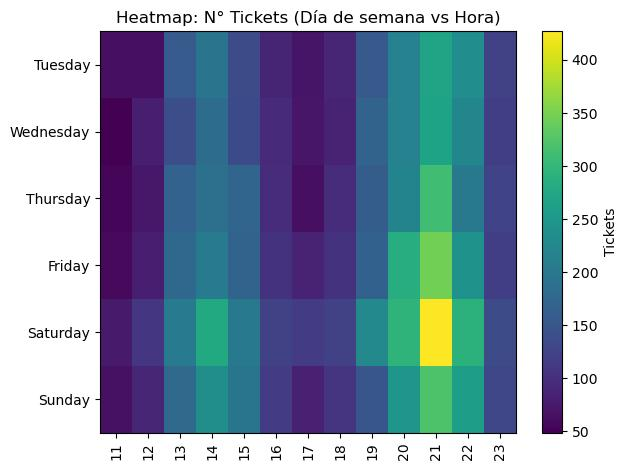
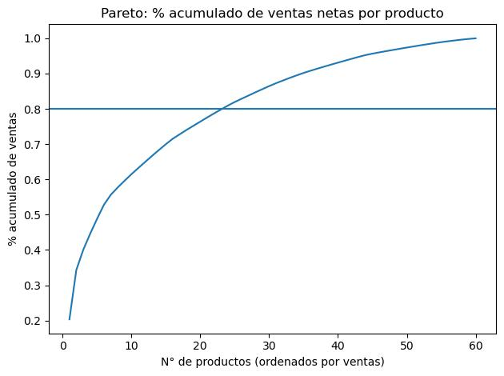
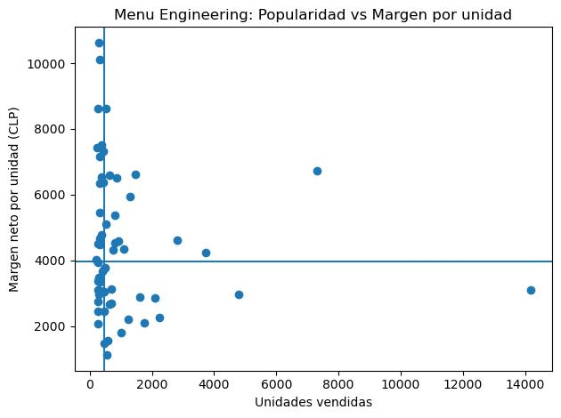

# Restaurant Demand Optimization (Forecasting + KPIs)

End-to-end Data Science project to **forecast demand** and **optimize restaurant profitability**, combining:
- Exploratory Data Analysis (EDA)
- Operational & financial KPIs
- Menu engineering
- Predictive models (baselines + ML + time series)
- Evaluation and business recommendations

> Built as a portfolio project (GitHub/LinkedIn): modular, reproducible, and adaptable to different restaurant contexts.

**Language / Idioma:** English | [Español](README.es.md)

---

## Business Goal

Optimize:
- **Profitability** (margin and estimated profit)
- **Waste reduction** (better purchasing and inventory planning)
- **Operations** (staffing by shift, production planning)
- **Demand forecasting**: **daily**, **weekly**, and **30-day** horizons

---

## Config & Assumptions (adaptable)

These parameters are configurable to reuse the project across different restaurants:

- **Base currency**: CLP (configurable)
- **Tax**: VAT 19% (configurable)
- **Tip**: optional 10% (excluded from revenue by default)
- **Channels**: `dine_in`, `takeaway`, `delivery`
- **Menu size (SKUs)**: typically 40–80 (configurable)
- **Typical opening hours**: 11:00–00:00, 6 days/week (configurable)

---

## Data (POS & Operations)

Expected data (real or synthetic):
- Date/time, tickets/receipts, products, quantities, prices
- Ingredient/recipe costs (for food cost)
- Inventory and turnover
- Staffing per shift and labor costs (for productivity)
- Monthly fixed costs (for profit estimates)

> Best practice: `data/raw/` and `data/processed/` are not committed to Git.

---

## Project Structure

```text
restaurant-demand-optimization/
├── data/
│   ├── raw/              # gitignored
│   └── processed/        # gitignored
├── notebooks/
├── src/
│   ├── forecasting/
│   ├── kpis/
│   └── main.py
├── reports/
├── README.md
├── README.es.md
├── requirements.txt
├── .gitignore
└── .gitattributes
```

<!--
  Sección "Resultados y Conclusiones" para pegar en el README del repo
  restaurant-demand-optimization (versión ES + EN).

  Las imágenes deben estar subidas a la RAÍZ del repo con estos nombres:
    heatmap_demanda.jpg
    pareto_ventas.jpg
    menu_engineering.jpg
-->

## 📊 Resultados y conclusiones (ES)

> Hallazgos obtenidos sobre un dataset tipo POS (datos sintéticos reproducibles, 60 productos).

### Patrón de demanda


Se identifican **dos peaks claros**: almuerzo (13:00–15:00) y cena (20:00–22:00), con el máximo el **sábado ~21:00**. Este patrón permite planificar turnos, ajustar la *mise en place* / inventario y reducir quiebres en horas punta.

### Concentración de ventas (Pareto 80/20)


**23 de 60 productos (≈38%) explican cerca del 80% de las ventas.** Foco operativo: asegurar disponibilidad de esos *top sellers*, optimizar su compra e inventario, y simplificar la cola larga del menú.

### Menu Engineering


Cruzando **popularidad (unidades vendidas) vs. margen por unidad**, cada producto cae en uno de cuatro cuadrantes:

- **Estrellas** — alta venta y alto margen → proteger y destacar.
- **Caballos de batalla** — alta venta, menor margen → optimizar costo o subir precio con cuidado.
- **Puzzles** — alto margen, baja venta → promocionar o reubicar en la carta.
- **Perros** — baja venta y bajo margen → candidatos a eliminar.

### KPIs calculados
Ventas netas/brutas, ticket promedio, *food cost %* y margen por producto, además de KPIs operativos por turno.

### Forecasting de demanda
Serie de demanda diaria con *backtesting* sobre los últimos 30 días (**sin data leakage**). Se comparan baselines contra modelos de series de tiempo (ver `notebooks/03_forecasting.ipynb`):

| Modelo | MAE | RMSE | MAPE |
|---|---|---|---|
| **SARIMAX(1,1,1)(1,1,1)₇** 🏆 | **15.3** | **19.2** | **13.3%** |
| Holt-Winters (ETS aditivo) | 15.7 | 19.4 | 13.3% |
| Naive estacional (semanal) | 19.5 | 24.4 | 19.4% |
| Naive | 34.5 | 51.4 | 17.7% |

El modelo estacional **SARIMAX** gana y reduce a menos de la mitad el error (RMSE) del *naive*. Se genera un pronóstico a **30 días** para apoyar compras y planificación de turnos.

---

## 📊 Results & Conclusions (EN)

> Findings on a POS-like dataset (reproducible synthetic data, 60 products).

### Demand pattern


Two clear peaks: lunch (1–3 PM) and dinner (8–10 PM), peaking on **Saturday ~9 PM**. Useful for shift planning, mise en place / inventory, and reducing stockouts at peak hours.

### Sales concentration (80/20 Pareto)


**23 of 60 products (~38%) drive ~80% of sales.** Focus on keeping top sellers in stock, optimizing their purchasing, and simplifying the menu's long tail.

### Menu Engineering


Crossing **popularity (units) vs. margin per unit**, each item falls into Stars, Workhorses, Puzzles, or Dogs — guiding pricing, promotion, and simplification.

### KPIs
Net/gross revenue, average ticket, food cost %, per-product margin, and operational KPIs per shift.

### Demand forecasting
Daily demand series with **backtesting** on the last 30 days (**no data leakage**). Baselines vs. time-series models (see `notebooks/03_forecasting.ipynb`):

| Model | MAE | RMSE | MAPE |
|---|---|---|---|
| **SARIMAX(1,1,1)(1,1,1)₇** 🏆 | **15.3** | **19.2** | **13.3%** |
| Holt-Winters (additive ETS) | 15.7 | 19.4 | 13.3% |
| Seasonal naive (weekly) | 19.5 | 24.4 | 19.4% |
| Naive | 34.5 | 51.4 | 17.7% |

The seasonal **SARIMAX** model wins, more than halving the naive error (RMSE). A **30-day** forecast supports purchasing and staffing.
